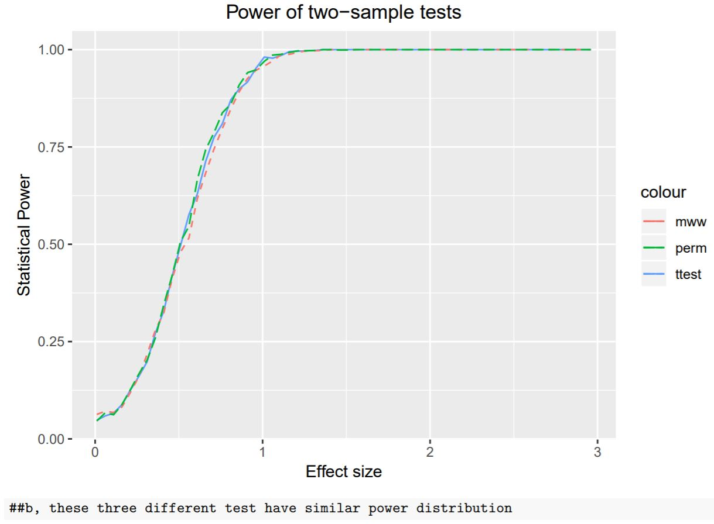
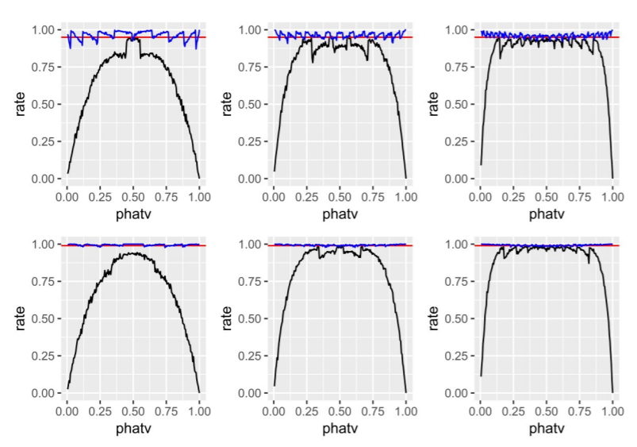
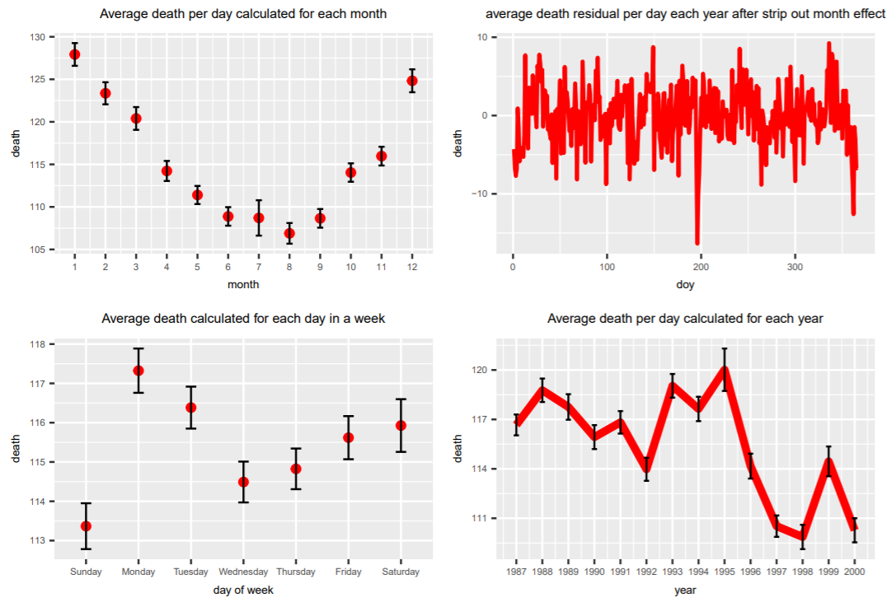
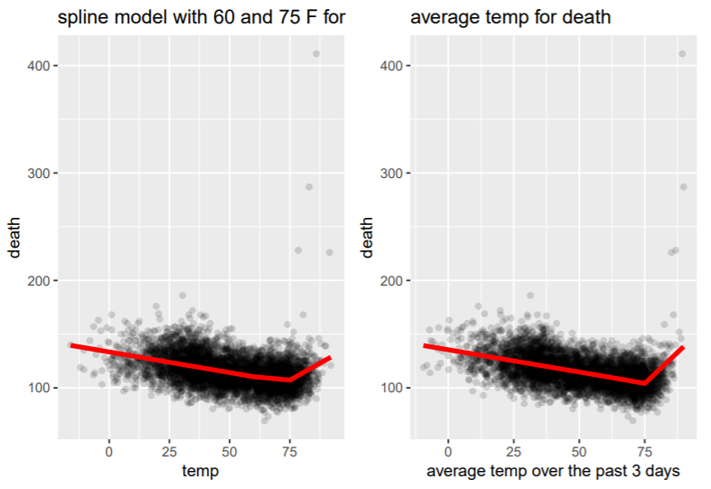
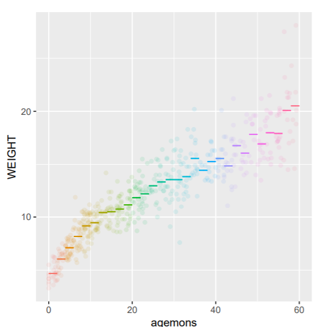
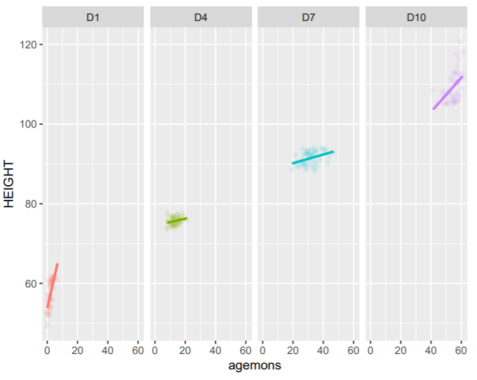
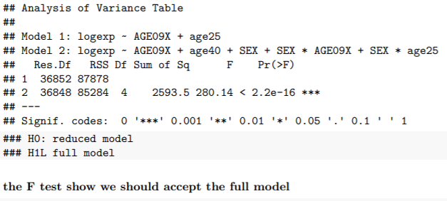
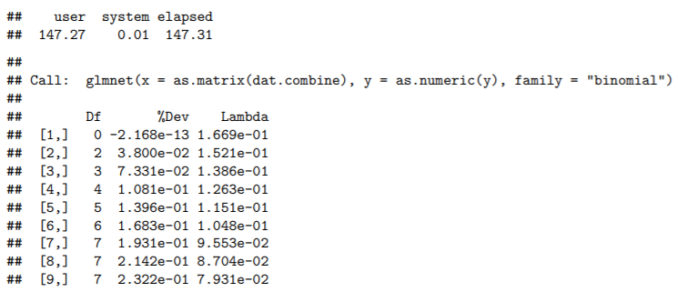
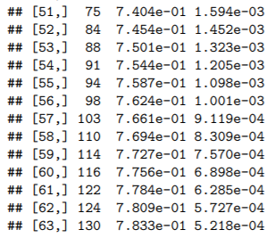

# Project Description
Term: Fall 2018

+ Project summary: Using MEPS(Medical Expenditure Panel Survey) data, I want to explore the data, and finally analyze the social economic cost of smoking.

# Data Description

+ https://www.meps.ahrq.gov/mepsweb/

MEPS is a set of large-scale surveys of families and individuals, their medical providers (doctors, hospitals, pharmacies, etc.) and employers across the United States. MEPS collects data on the specific health services that Americans use, how frequently they use them, the cost of these services, and how they are paid for, as well as data on the cost, scope, and breadth of health insurance held by and available to U.S. workers.

# Different test:

Compaired different test and their test power related to the effective size

Detailed code: 

https://github.com/Shanlearning/Medical-expanditure-project/blob/master/test_power.pdf
https://github.com/Shanlearning/Medical-expanditure-project/blob/master/test_power2.pdf

## sample graph:

# trend and seasonality in the death

Detailed code: 

https://github.com/Shanlearning/Medical-expanditure-project/blob/master/trend_in_death.pdf

## sample graph:

# Significant growth age of babies:

Detailed code: 

https://github.com/Shanlearning/Medical-expanditure-project/blob/master/baby_weight_at_different_age.pdf
https://github.com/Shanlearning/Medical-expanditure-project/blob/master/baby_weight_at_different_age2.pdf

## sample graph:
#### baby weight by age(in month):

#### significant growth ages:

# Lasso model for variable selection:

Detailed Description:

https://github.com/Shanlearning/Medical-expanditure-project/blob/master/lasso_variable_selection.pdf
https://github.com/Shanlearning/Medical-expanditure-project/blob/master/model_to_predict_expense.pdf

## sample graph:

### model compare:

### variable selection (df shows number of variables selected):

