----

# Project Description
Term: Spring 2018

+ Project summary: Using Facebook anonymous data, I want to analyze the social circles between people and see if we can find common social circles or groups. 

# Data Description

+ https://snap.stanford.edu/data/ego-Facebook.html

This dataset consists of 'circles' (or 'friends lists') from Facebook. Facebook data was collected from survey participants using the Facebook app.

Facebook data has been anonymized by replacing the Facebook-internal IDs for each user with a new value.

From Facebook, obtained profile and network data from 10 ego-networks, consisting of 193 circles and 4,039 users. These 10 people were asked to manually identify all the circles to which their friends belonged.

The FROM and TO are Undirected! (a 'friends' relation is bidirectional; being friends goes both ways)
+ Data like the number of emails sent will only have one direction (unidirectional)

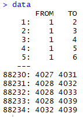

Here is a graph for all the users:

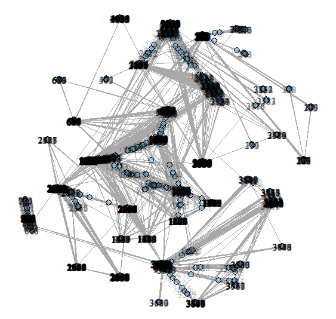

People with common friends may be in the same social circles (such as high school, family, colleagues, etc.)

The goal is to find an unsupervised learning method to classify and analyze these social circles.

# Baseline Model:

There are many model available.

Some models only consider the edge (link) between users, some only consider the profile of user, and some models are mixed.

For my models, I will only consider the edge/link between users (or only consider the network of users), and will pretend I do not have the right answer for the social circles of each user.

## 1. Hierarchical clustering with Agglomerative-Euclidean-single-linkage clustering approach:
    
Agglomerative:
+ "Bottom up" approach: each observation starts in its own cluster, and pairs of clusters are merged as one moves up the hierarchy. Hierarchical clustering seeks to build a hierarchy of clusters.
+ Distance metric: Euclidean distance; i.e. the "ordinary" straight line distance between two points in a Euclidean space.
+ Distance of each circle: Minimum over all pairs of users these two circles.

First, I change the data into a matrix form:

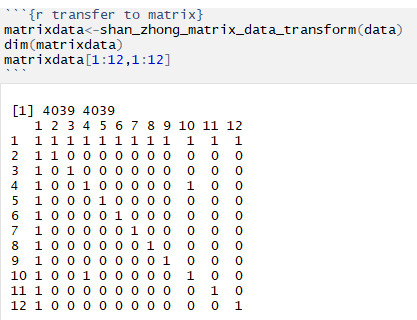

Then we calculate the distance for each user.

Here is an example for the distances of 4 users (we are using Euclidean distance, since there are many ways to define the distance):

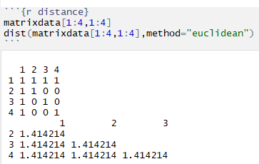

Let's begin by looking at user 1, one of the 10 people who manually identified all the circles to which his friends belonged.
+ User 1 is friends with User 2 to User 346

The computation times do not vary much, as can be seen in the below image:

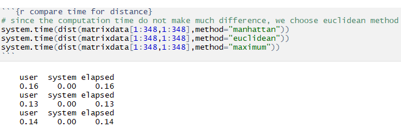

Now we calculate the distance for each circle. There are many methods to define the distance between two circles:
+ Single : Minimum over all pairs of users these two circle.
+ Complete : Maximum over all pairs of users these two circle.
+ Average : Average over all pairs of users these two circle.

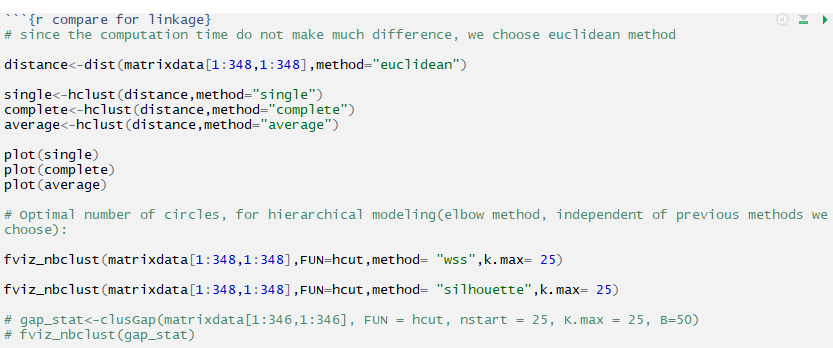

#### Hierarchical modeling (Single [minimum] method)

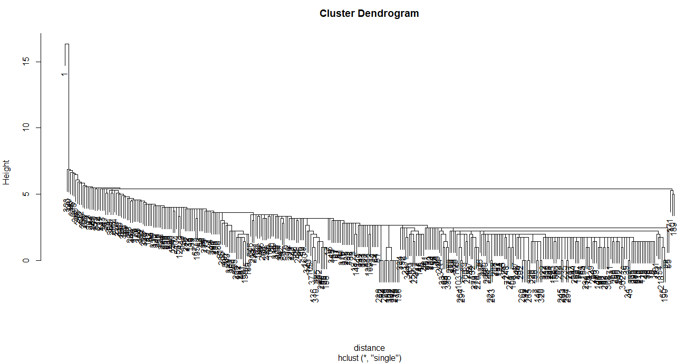

#### Hierarchical modeling (Complete [maximum] method)

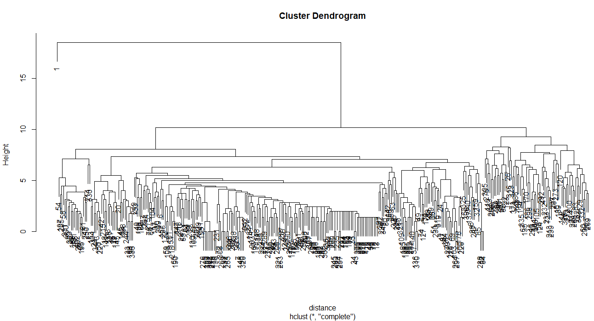

#### Hierarchical modeling (Average method)

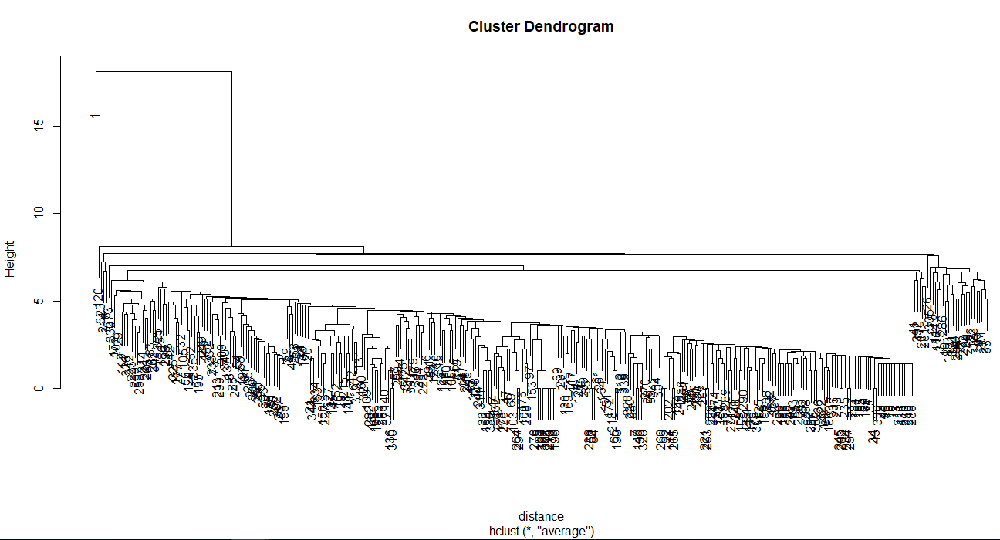

#### Optimal number of circles (or clusters), for hierarchical modeling (other method, independent of previous methods we choose):

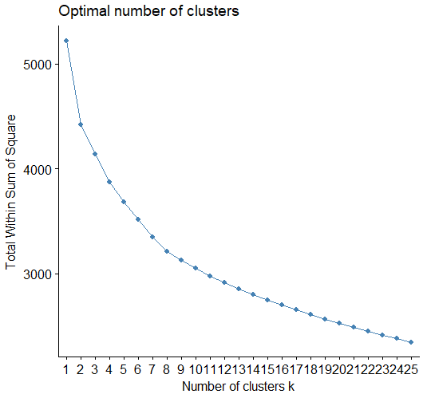
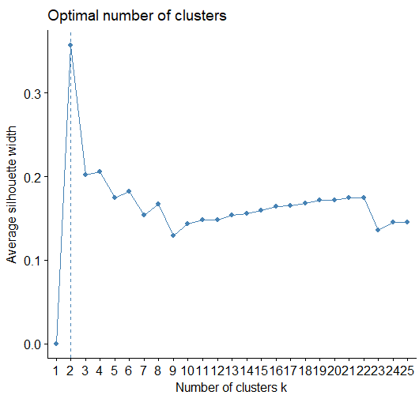

## Model 2: Structural cohesion

Structural Cohesion is the minimum number of actors in a social network that need to be removed to disconnect the group. 
+ Node connectivity on graphs
+ Is used as a formal definition to measure cohesion in social groups

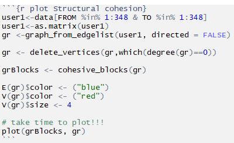

Below is the structural cohesion circle of user 1. All friends of user 1 are shown in the graph!

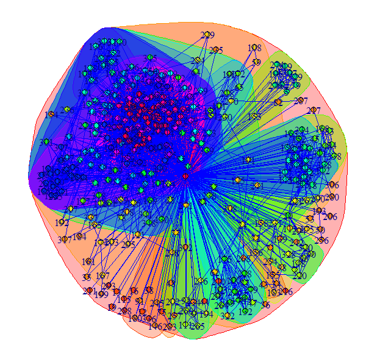

This leads us to our superior model, the mixed membership stochastic blockmodels.

# Model 3: Mixed Membership Stochastic Blockmodels
#### by E.M. Airoldi, D.M. Blei, S.E. Fienberg, E.P. Xing, Journal of Machine Learning Research, 2008

### Interpretation:  

Let's go back to the adjacency matrix
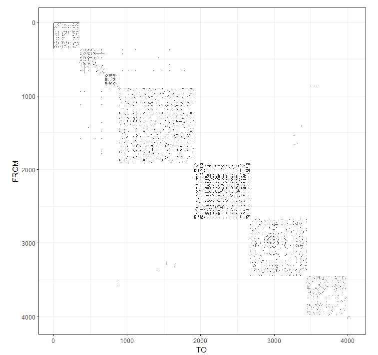

### Infinite Relational Model:
+ Randomly choose one point in the above matrix, there is a related p(row) and q(column),
+ The p and q stands for nodes (which are the users).
+ Assume we have k circle(block) in total
+ Assume each node (user) belongs to exactly one circle (block), make it a vector Zp,(or Zq):
+ Example: (0,0,1,0) if p belongs to the third circle and (block) there are 4 circles (block) in total.
+ B is a k*k matrix that describes the relationship between each circle (block), and B(g,h) represents the probability of having a link between a user from group g and a user from group h
+ If p is in block g and q is in block h then the probability of observing an interaction from node p to node q is B(g,h).
+ Then, the relation between p and q, or Y(p,q), is Bernoulli( t(Zp)*B*Zq )
++ The t here stands for transpose.
++ * is matrix multiplication
++ For example, if p is in block 3 and q is in block 2 then P(Y(p, q) = 1) = B32.

### Mix membership model:
+ Each Zp has a distribution over the latent blocks! (So they can be in different blocks at the same time!)
+ Assume there are K circles (blocks) and N users (nodes)! Y(p,q) are binary: 0 or 1
+ Because our data is undirected, we do not need to worry about the direction of Z

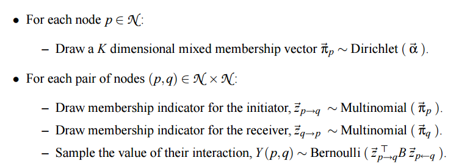                                          

Below is a graphical model of the above process. We did not draw all the arrows out of the block model B for clarity of the image:

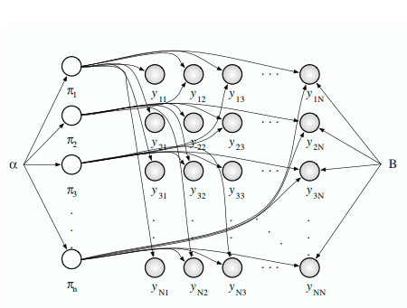
    
Below is the Bayesian model representing the above process:

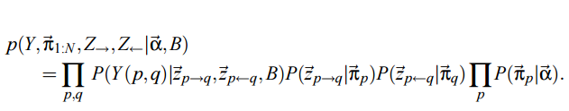    
    
####
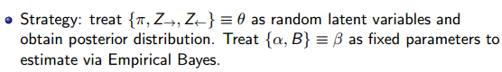 
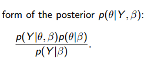 

The denominator (No closed form solution!!!!!!!!! Use variational methods, do not expand here):   
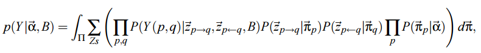   

Determine the optimal number of K
+ We will just choose 9 as the optimal number for simplicity

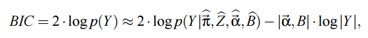   
where |α,B| is the number of hyper-parameters in the model, and |Y| is the number of positive relations observed.

By implementing the following R code:

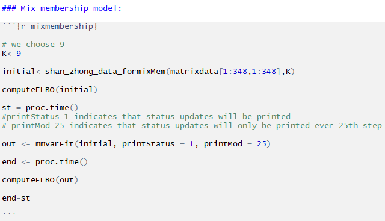   

Below is the likelihood comparison and time elapsed:

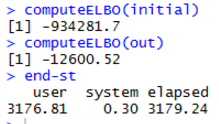   

### Our Prediction:
  

By zooming in, we can see the matrix plot for user 1:
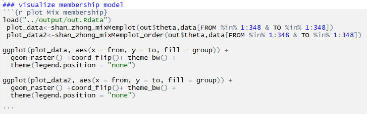  
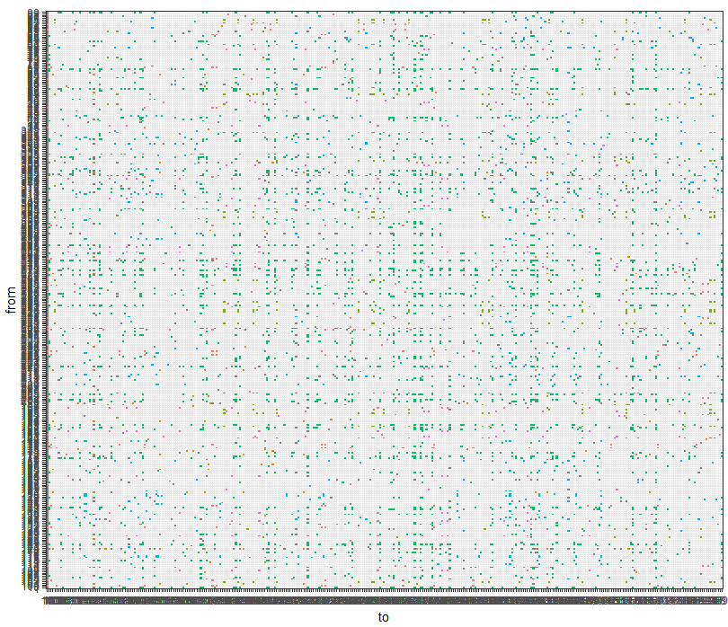  
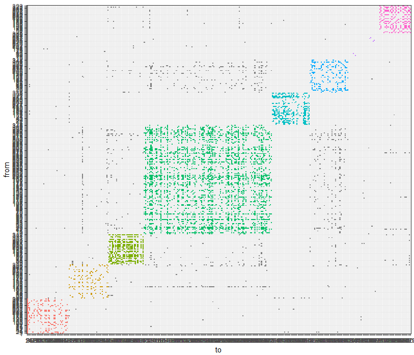

We use igraph package built into the algorithm because it is much faster than the previous algorithm:

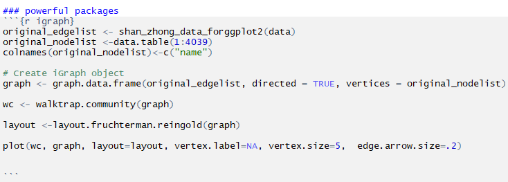

For user 1:

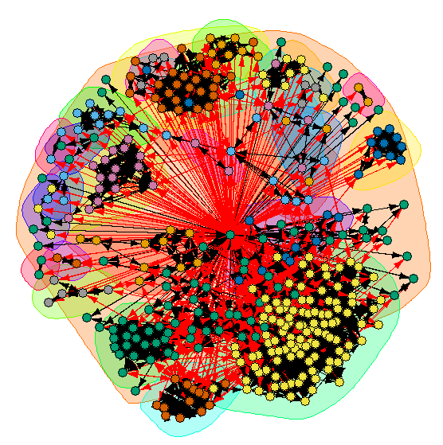  

And for all users :

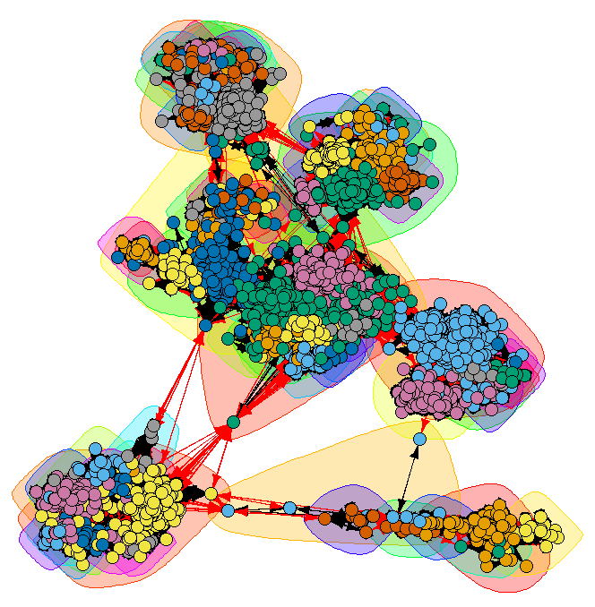

## References
http://i.stanford.edu/~julian/pdfs/nips2012.pdf

http://www.analytictech.com/e-net/pdwhandout.pdf

https://uc-r.github.io/hc_clustering

https://courses.washington.edu/b572/TALKS/2014/TedWestling-2.pdf

http://www.stat.cmu.edu/~brian/905-2009/all-papers/airoldi08a.pdf

https://cran.r-project.org/web/packages/mixedMem/vignettes/mixedMem.pdf
